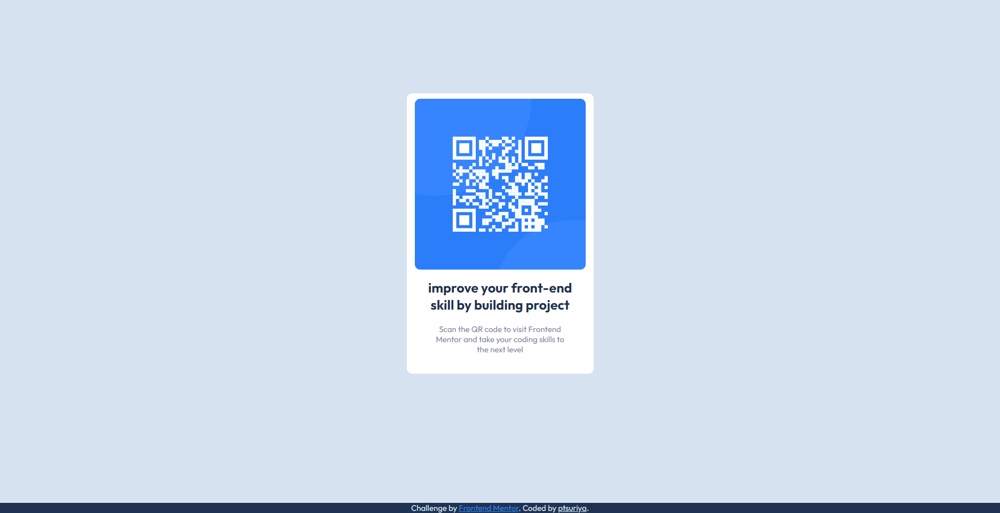

# Frontend Mentor - QR code component solution

This is a solution to the [QR code component challenge on Frontend Mentor](https://www.frontendmentor.io/challenges/qr-code-component-iux_sIO_H). Frontend Mentor challenges help you improve your coding skills by building realistic projects. 

## Table of contents

- [Overview](#overview)
  - [Screenshot](#screenshot)
  - [Links](#links)
- [My process](#my-process)
  - [Built with](#built-with)
  - [What I learned](#what-i-learned)
- [Author](#author)
- [Acknowledgments](#acknowledgments)

**Note: Delete this note and update the table of contents based on what sections you keep.**

## Overview

### Screenshot




### Links

- Solution URL: [Solution here](https://www.frontendmentor.io/solutions/just-flex-box-KItAKSerlv)
- Live Site URL: [Live site URL here](https://ptsuriya.github.io/Frontend-Mentor_QR-code-component/)

## My process

### Built with

- Semantic HTML5 markup
- CSS custom properties
- Flexbox

### What I learned

I review HTML , CSS alot inhere

example

```html
<footer></footer> 
```
dosen't work anymore , i don't know how but i do style on my on at this css 

```css

.footer{
position: fixed;
left: 0;
bottom: 0;
width: 100%;
}
```
and i also learn how to use @ media for manage 

```css

@media only screen and (max-width: xxxpx){

}
```

## Author

- Website - (not yet)
- Frontend Mentor - [@ptsuriya](https://www.frontendmentor.io/profile/ptsuriya)
- Twitter - [@Kuma_Midnight](https://twitter.com/Kuma_Midnight)


## Acknowledgments

google font is a lot of font to use


